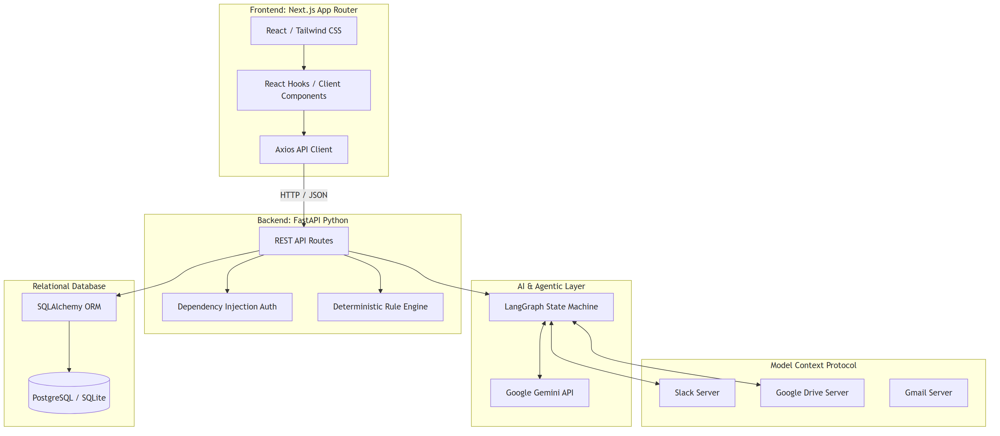
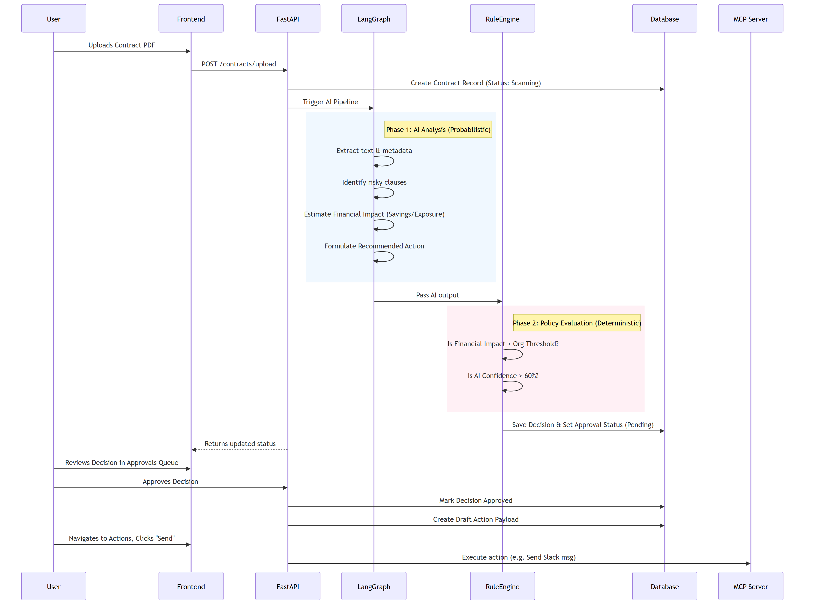
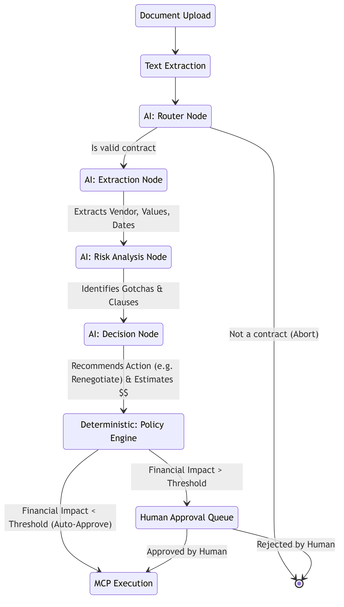
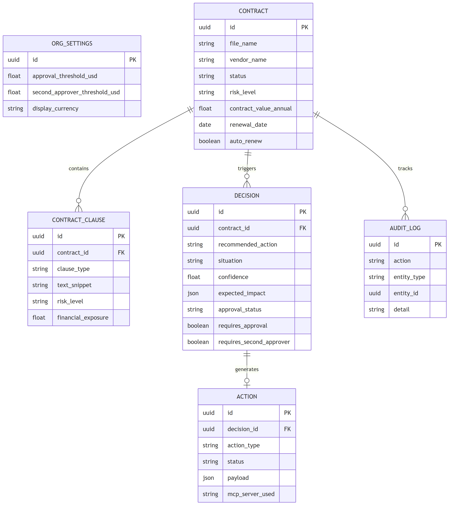

# FinePrint 📜

**FinePrint** is an **AI-powered contract risk monitoring, decisioning, and automated governance platform.**

It acts as a digital legal and compliance assistant that autonomously ingests contracts, analyzes them for hidden risks (like auto-renewals, predatory termination penalties, and weak SLAs), estimates financial exposure, and recommends mitigating actions. Crucially, it blends **probabilistic AI analysis** with a **deterministic policy rule engine** to enforce human-in-the-loop (HITL) approvals before any action is executed.

---

## 🎯 Core Concept & Problem Solved

**The Problem:** Enterprises lose millions annually to "gotcha" clauses in vendor contracts—auto-renewals that trigger unnoticed, SLA breaches that go unpenalized, and predatory termination fees. Legal teams don't have the bandwidth to constantly monitor every signed contract.

**The Solution:** FinePrint acts as an always-on contract intelligence layer.

1. **Analyze:** AI reads the contract and flags risks.
2. **Decide:** It proposes an action (e.g., "Draft an email to renegotiate the SaaS auto-renewal").
3. **Govern:** A deterministic rule engine checks the financial impact against organization policies. If the impact exceeds a threshold (e.g., $5,000), it halts execution and requires human approval.
4. **Execute:** Once approved, it uses Model Context Protocol (MCP) integrations to actually draft the Slack message or email.

---

## 🏗️ System Architecture & Tech Stack

FinePrint is a modern, decoupled web application.

### Tech Stack Diagram

### Stack Breakdown

- **Frontend:** Next.js 14, React, Tailwind CSS. Custom "Premium GitHub-style" UI with light/dark modes.
- **Backend:** FastAPI (Python), SQLAlchemy ORM, Pydantic for validation.
- **AI / Agents:** LangGraph (for multi-agent workflows) and LangChain.
- **Integrations:** Model Context Protocol (MCP) allows the AI to securely connect to external tools without hardcoding API integrations.

---

## 🔄 How the Flow Works (In-Depth)

The lifecycle of a contract in FinePrint follows a strict pipeline to ensure AI safety and determinism.

### High-Level Flow Diagram

---

## 🧩 Detailed Pipeline Execution (Activity Diagram)

The core "brain" of the application is a LangGraph state machine. It doesn't just make a single LLM call; it routes through specific specialized nodes.

---

## 🗄️ Database Architecture (Entity Relationship Diagram)

---

## 📖 Walkthrough Example: "The Predatory Marketing Contract"

Let's walk through exactly how the system handles a high-risk contract.

### Step 1: Ingestion

- A user uploads `high_risk_marketing_vendor.pdf` via the Dashboard.
- The `AuditLog` records: `Contract uploaded: high_risk_marketing_vendor.pdf`.

### Step 2: LangGraph AI Pipeline

- **Extraction Node**: Identifies the vendor as "Global Marketing Dynamics LLC" and an annual value of $150,000.
- **Risk Analysis Node**: Finds Clause 4: *"Client shall immediately pay the full remaining balance plus a 30% early termination penalty."* The AI flags this as **High Risk**.
- **Decision Node**: Formulates a situation report: "Contract contains predatory early termination penalties." It recommends action: `renegotiate`. It estimates potential savings of `$45,000` by removing the penalty.

### Step 3: Deterministic Policy Engine (The Safeguard)

- The backend pure-Python logic intercepts the AI's output.
- The organization's `approval_threshold_usd` is set to `$5,000`.
- The AI's estimated financial impact is `$45,000`.
- **Logic Eval:** $45,000 > $5,000.
- **Result:** The system overrides any auto-execution. It flags `requires_approval = True` and sets the status to `Pending`.

### Step 4: Human-in-the-loop (HITL)

- An alert appears on the **Approvals** page.
- The manager reviews the "Predatory Marketing Contract" decision.
- The UI clearly splits the **AI Analysis** (LLM Output) from the **Policy Evaluation** (Deterministic Output) so the manager knows exactly *why* it was flagged.
- The manager clicks **Approve**.

### Step 5: Action Execution (MCP)

- The approved decision generates a Draft Action payload.
- On the **Actions** page, the user sees a draft Slack message targeting the Legal channel: *"High risk contract detected for Global Marketing Dynamics. Please review Clause 4 regarding a 30% termination penalty before signing."*
- The user clicks **Send**. FinePrint uses the integrated Slack MCP server to securely post the message without the core backend needing to know how the Slack API works.

---

## 🚀 Key Interview Talking Points

If you are presenting this project, emphasize these architectural decisions:

1. **AI Safety via Hybrid Architecture:** You didn't just build an "LLM wrapper." You built a system that uses AI for what it's good at (unstructured text understanding) but wraps it in a **deterministic policy engine** (if/else logic) for financial controls. The AI *suggests*, the rules engine *governs*, the human *approves*.
2. **Model Context Protocol (MCP):** Using MCP for integrations demonstrates a forward-thinking architecture. Instead of hardcoding API keys for Slack, Jira, and Gmail, the application dynamically delegates execution to MCP servers.
3. **Data Modeling & Auditability:** The presence of a dedicated immutable `AuditLog` table and the separation of `Contract` -> `Decision` -> `Action` models shows enterprise-grade system design.
4. **UI/UX Separation of Concerns:** The frontend deliberately separates probabilistic data (AI confidence scores, extracted snippets) from deterministic data (policy rules passed/failed) to build user trust.
